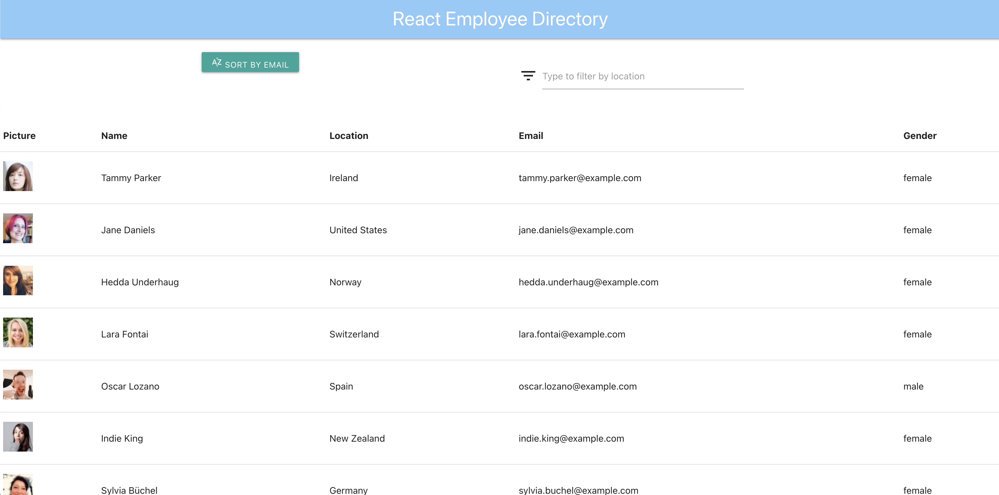

# React-Employee-Directory

React web application that displays 20 random employee in a table using the randomuser.me API. Materialize css is used for styling with gh-pages being used for hosting. Users can sort by email address and filter by location.
    
- [Installation](#installation)
- [Usage](#usage)
- [License](#license)
- [Contributions](#contributions)
- [Tests](#test)
- [Questions](#questions)
    
## Installation
    
1. Access main branch at my github repo and clone to your local folder to install app: https://github.com/204039643/react-employee-directory
2. Navigate to app. folder on local and run 'NPM INSTALL' in the CLI.
3. I used gh-pages to publish to cloud hosting site. To do so, update package.json "homepage:" key value to point to your new published app URL using the format> http://yourgithubid.github.io/yourappname".
4. Switch to 'master' branch for github pages.
5. Link and push newly cloned project to GitHub by running the following commands in the CLI:
- git add .
- git commit -m "first commit"
- git remote add origin git@github.com:username/guide-react-gh-pages.git
- git push -u origin master
6. Run "NPM RUN DEPLOY" script in CLI which will do a prod. build and then deploy to your gh-pages repo.
7. Navigate to the newly deployed app in your browser to validate deployment and functionality.

    
## Usage
    
1. Access app. using your favorite browser (hosted in gh-pages): https://204039643.github.io/react-employee-directory/
2. A listing of 20 random users will be displayed in a table. Click the 'sort' button to re-sort list by email.
3. Type in the input field to filter table by employee location.
    
## License
    
MIT
    
Copyright (c) [2021] Justin Sykes
    
Permission is hereby granted, free of charge, to any person obtaining a copy
of this software and associated documentation files (the "Software"), to deal
in the Software without restriction, including without limitation the rights
to use, copy, modify, merge, publish, distribute, sublicense, and/or sell
copies of the Software, and to permit persons to whom the Software is
furnished to do so, subject to the following conditions:
    
The above copyright notice and this permission notice shall be included in all
copies or substantial portions of the Software.
    
THE SOFTWARE IS PROVIDED "AS IS", WITHOUT WARRANTY OF ANY KIND, EXPRESS OR
IMPLIED, INCLUDING BUT NOT LIMITED TO THE WARRANTIES OF MERCHANTABILITY,
FITNESS FOR A PARTICULAR PURPOSE AND NONINFRINGEMENT. IN NO EVENT SHALL THE
AUTHORS OR COPYRIGHT HOLDERS BE LIABLE FOR ANY CLAIM, DAMAGES OR OTHER
LIABILITY, WHETHER IN AN ACTION OF CONTRACT, TORT OR OTHERWISE, ARISING FROM,
OUT OF OR IN CONNECTION WITH THE SOFTWARE OR THE USE OR OTHER DEALINGS IN THE
SOFTWARE.
    
## Contributions
    
- React library (https://reactjs.org/)
- Materialize CSS framework (https://materializecss.com/)
- Node JS runtime (https://nodejs.org/en/)
- NPM packages: Axios (https://www.npmjs.com/package/axios), gh-pages (https://www.npmjs.com/package/gh-pages), react (https://www.npmjs.com/package/react)
    
## Tests
    
None
    
## Questions?
Please reach out to me at either of the following:
GitHub username: 204039643
Email: atlsykes1@att.net
    
    
 ---This README was generated using nice-readme-generator :-) ---